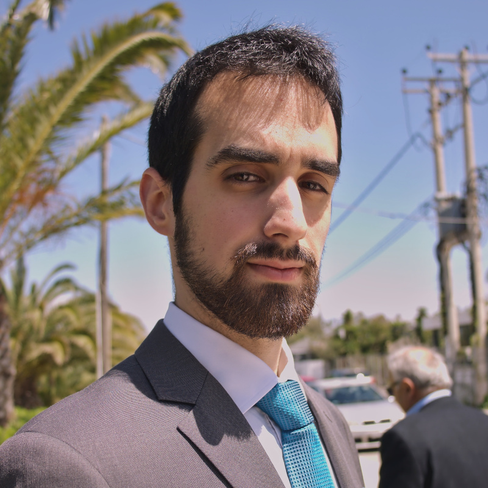
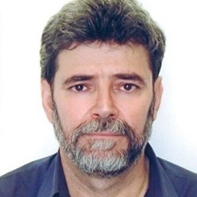
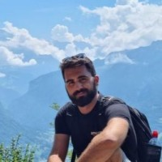

---
  hide:
    -navigation
---

# Principal Investigator

## Konstantinos Chatzilygeroudis

{: style="width:10%"}

**Short bio:** Konstantinos Chatzilygeroudis received the Integrated Master degree (Engineering Diploma) in computer science and engineering from the University of Patras, Patras, Greece, in 2014, and the Ph.D. degree in robotics and machine learning from Inria Nancy-Grand Est, France and the University of Lorraine, Nancy, France in 2018. From 2018 to 2020 he was a Postdoctoral Fellow with the LASA Team with the Swiss Federal Institute of Technology Lausanne (EPFL), Lausanne, Switzerland. He is a recipient of an H.F.R.I. Grant for Post-doctoral Fellows (2022-2024): he is the Principal Investigator of the project "Novel Optimization Methods for Autonomous Skill Learning in Robotics" that is being implemented within the Department of Mathematics, University of Patras, Greece. He has also taught and is still teaching several undergraduate and post-graduate courses on Artificial Intelligence, Computer Science and Robotics at University of Patras, Greece. He has also co-supervised several undergraduate and master theses. He is currently serving as an Associate Co-Chair of the IEEE Technical Committee on Model-based Optimization for Robotics, while he has served as an Associate Editor for several years at the International Conference on Intelligent Robotics (IROS) and actively participated in the organization committee (as a Chair responsible for the virtual part of the conference) of the International Conference on Robot Learning (CoRL) 2021. His work has been published in top-tier journals and conferences in the fields artificial intelligence, machine learning and robotics, and he has received a Best Paper Award at GECCO 2022. He has also actively collaborated with industrial partners: he was the Leader of the R&D Computer Vision Team at Metargus, a pre-seed funded startup (based in Patras, Greece), and he was the Lead Robotics Engineer at Ragdoll Dynamics (company based in London, UK). His research interests include the area of artificial intelligence and focus on reinforcement learning, fast robot adaptation, evolutionary computation and autonomous skill discovery.

**Website:** [https://costashatz.github.io](https://costashatz.github.io)

# Research Team

## Research Associate

{: style="width:10%"}

**Info:** We are seeking for a full time research associate to join the project.

## Research Associate

{: style="width:10%"}

**Info:** We are seeking for a part time research associate to join the project.

<!-- ## Konstantinos Tsinganos

{: style="width:10%"}

**Short bio:** [Under Construction]

**Website:** [https://kostastsing.github.io](https://kostastsing.github.io) -->

# Advisory Board

## Michael Vrahatis

{: style="width:10%"}

**Short bio:** Michael N. Vrahatis (Greek: Μιχαήλ Ν. Βραχάτης) was born in Kalamata, Greece, on April 27, 1955. He received his Diploma in Mathematics (first academic degree, Ptychio) from the University of Patras in 1978 and his PhD in Mathematics from the same Institution in 1982. His PhD advisor was Prof. Dr. Kosmas I. Iordanidis. He subsequently performed his military service in the Hellenic Navy from January 1983 to March 1985. He is a professor in the Department of Mathematics at the University of Patras since 2000. He is founder of the Computational Intelligence Laboratory of the same department which he has been directing since its beginning in 2004. He is also serving as the director of the newly founded Institute of Artificial Intelligence of University Research Center of Patras. He has been teaching at the undergraduate level for 41 years (including 4 years teaching assistantship). Also, he has been teaching distance learning classes at the Hellenic Open University for 21 years. In addition, he has a teaching experience of 30 years at the post graduate level (including the year 2022–2023). Several of his doctoral and/or postdoctoral students serve as full professors, associate professors, assistant professors or lecturers in Greece and abroad. He was a visiting research fellow (faculty member) at the Department of Mathematics, Cornell University, Ithaca, NY, USA (1987–1988). He was a visiting professor at: a) INFN (Istituto Nazionale di Fisica Nucleare), Bologna, Italy (1992, 1994 and 1998); b) Department of Computer Science, Katholieke Universiteit Leuven, Belgium (1999); c) Department of Mechanical Engineering, Center for Ocean Engineering, Design Laboratory, MIT, Cambridge, MA, USA (2000) and d) Collaborative Research Center "Computational Intelligence" (SFB 531) at the Department of Computer Science, University of Dortmund, Germany (2001). He was a visiting researcher at: a) CERN (European Organization of Nuclear Research), Geneva, Switzerland (1992) and b) INRIA (Institut National de Recherche en Informatique et en Automatique), Sophia–Antipolis, France (1998, 2003, 2004 and 2006). He has served as an experienced reviewer and evaluator of several proposals for research funding organizations and centers of excellence, including, among others, ERC (EU), ESF (EU), FWF (Austria), GSRT (Greece), HFRI (Greece), IAP (Belgium), MITACS (Canada) and NSF (USA). He has participated in the organization of over 320 conferences serving at several positions, and participated in over 250 conferences, congresses and advanced schools as active participant, speaker or keynote speaker. He has served as a reviewer for 73 international scientific journals and 7 books. His editorial activities include work for 23 international scientific journals, journal special issues and book series. The corpus of his work consists of over 400 publications: a) 17 books (including one book published in USA), b) 152 papers in international refereed journals, c) 26 papers in invited and refereed book chapters, d) 73 papers in refereed book chapters and edited volumes, e) 172 papers in refereed conference proceedings and f) 76 other scholarly publications (including international technical reports (one of CERN, three of INRIA, three of University of Dortmund), invited book–reviews, seminar proceedings, two non–refereed journal papers and one non–refereed full–paper conference article, among others).

**Website:** [https://thalis.math.upatras.gr/~vrahatis](https://thalis.math.upatras.gr/~vrahatis)

## Jean-Baptiste Mouret

{: style="width:10%"}

**Short bio:** [Under Construction]

**Website:** [https://members.loria.fr/JBMouret](https://members.loria.fr/JBMouret)

## Dimitrios Kanoulas

{: style="width:10%"}

**Short bio:** Dimitrios Kanoulas is a UKRI Future Leader Fellow and Associate Professor in Robotics and Computation at University College London (UCL), Department of Computer Science, working in the field of perception and learning for robots that have limbs, including quadrupeds, humanoids, and mobile manipulators. Between 2014-2019 he was a senior postdoctoral researcher at the Italian Institute of Technology (IIT), working with Profs Nikos Tsagarakis and Darwin Caldwell on several EU projects. In August 2014, he completed his PhD at Northeastern University, advised by Prof. Marsette Vona on perception for bipedal locomotion. He started out as a member of the Algorithms and Theory group at Northeastern University. During the summer of 2012, he completed an internship at INRIA in France, advised by Drs Christian Laugier and Alexandros Makris. He received a diploma in Computer Engineering and Informatics Department from University of Patras, Greece in 2008, advised by Prof Paul Spirakis and Dr Charalampos Tsaknakis.

**Website:** [https://dkanou.github.io](https://dkanou.github.io)

# Collaborators

## Dionis Totsila

{: style="width:10%"}

**Short bio:** [Under Construction]

**Website:** [https://github.com/DionisTotsila](https://github.com/DionisTotsila)

## Agisilaos Kounelis

{: style="width:10%"}

**Short bio:** [Under Construction]

**Website:** [https://www.linkedin.com/in/kounelisagis](https://www.linkedin.com/in/kounelisagis)
