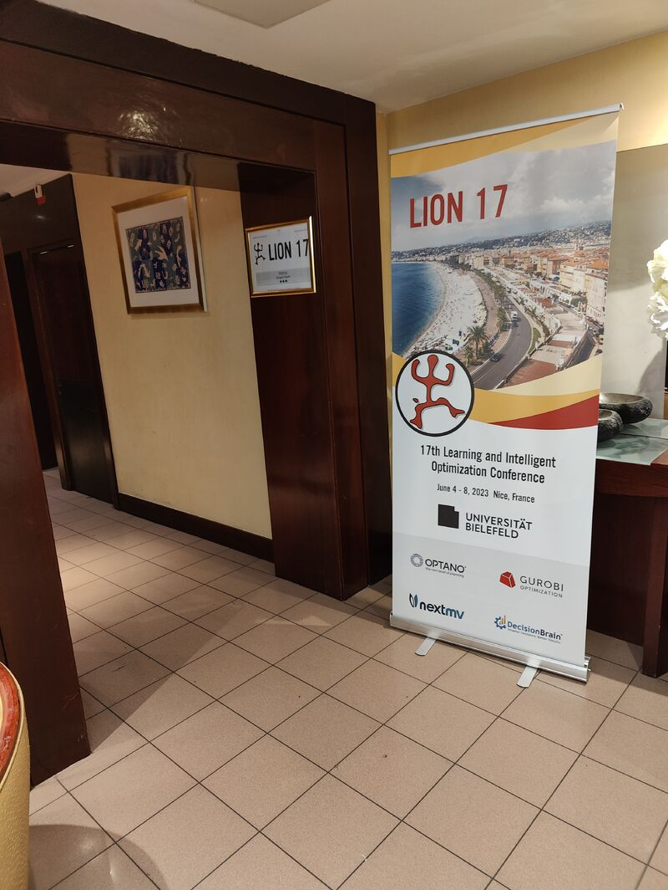

---
  hide:
    -navigation
---

## 14th December 2024

Our paper **"Sensorimotor Learning with Stability Guarantees via Autonomous Neural Dynamic Policies"** by *Totsila, D., Chatzilygeroudis, K., Modugno, V., Hadjivelichkov, D. and Kanoulas, D.* has been accepted at the *[IEEE Robotics and Automation Letters (RA-L)](https://www.ieee-ras.org/publications/ra-l)*. More information on our paper [here](publications.md).

## 26th November 2024

Our paper **"Integrating Trajectory Optimization in Quality-Diversity for Kinodynamic Motion Planning"** by *Asimakopoulos, K., and Chatzilygeroudis, K.* has been accepted at the *[11th International Conference on Automation, Robotics, and Applications (ICARA 2025)](https://icara.us/)*. More information on our paper [here](publications.md). See you at Zagred in February 2025!

## 24th October 2024

Our paper **"RobotDART: a versatile robot simulator for robotics and machine learning researchers"** by *Chatzilygeroudis, K., Totsila, D., and Mouret J.-B.* has been accepted at the *[Journal of Open Source Software (JOSS)](https://joss.theoj.org/)*. More information on our paper [here](publications.md). Read more about our library [here](https://nosalro.github.io/robot_dart/).

## 10th September 2024

Our paper **"Gait Optimization for Legged Systems Through Mixed Distribution Cross-Entropy Optimization"** by *Tsikelis, I., and Chatzilygeroudis, K.* has been accepted for presentation at the *[IEEE-RAS International Conference on Humanoid Robots (Humanoids)](https://2024.ieee-humanoids.org/)*. More information on our paper [here](publications.md). See you at Nancy in November 2024!

## 22th April 2024

Our short paper **"Effective Kinodynamic Planning and Exploration through Quality Diversity and Trajectory Optimization"** by *Asimakopoulos, K., Androutsopoulos, A., Vrahatis, M. and Chatzilygeroudis, K.* has been accepted for presentation at the *international conference [LION18](https://www.lion18.unina.it/)*. More information on our paper [here](publications.md). The following presentation-only abstracts have been accepted as well: 1) **"Effective Skill Learning via Autonomous Goal Representation Learning"** by *C. Tsakonas and K. Chatzilygeroudis*, and 2) **"Evolving Dynamic Locomotion Policies in Minutes"** by *K. Chatzilygeroudis, C. Tsakonas and M. Vrahatis*! See you at Ischia in June 2024!

## 15th June 2023

We are delighted to share that we have two papers accepted at The Fourteenth International Conference on Information, Intelligence, Systems and Applications ([IISA 2023](https://easyconferences.eu/iisa2023/))! At IISA 2023, we will be presenting **"Effective Skill Learning via Autonomous Goal Representation Learning"** by *C. Tsakonas and K. Chatzilygeroudis* and **"Evolving Dynamic Locomotion Policies in Minutes"** by *K. Chatzilygeroudis, C. Tsakonas and M. Vrahatis*. More information on our papers [here](publications.md). See you at Volos in July!

## 6th June 2023

We are at Nice (France) for [LION17](https://lion17.org)! On Thursday at 11:30 (French time) we are presenting **"Fast and Robust Constrained Optimization via Evolutionary and Quadratic Programming"**. Excellent collaboration with *Prof. Michael Vrahatis*.

Excellent organization by Kevin Tierney and the rest of the organization team!

- **Paper:** [pdf](http://costashatz.github.io/files/LION17.pdf)
- **Conference Program:** [full program](https://lion17.org/#program)

On Wednesday morning at 08:45 (French time) we (with Prof. Vrahatis) are also **hosting a special session on "Learning and Intelligent Optimization for Physical Systems"** where we will be presenting our work in progress "Sensorimotor Learning with Stability Guarantees via Autonomous Neural Dynamic Policies"!

{: style="width:40%"}

## 28th May 2023

We are excited to announce that we have a short paper accepted at the [Life-Long Learning with Human Help (L3H2) Workshop](https://life-long-learning-with-human-help-l3h2.github.io/) at the IEEE International Conference on Robotics and Automation (ICRA). We will be presenting our work in progress on **"Sensorimotor Learning with Stability Guarantees via Autonomous Neural Dynamic Policies"** (paper title: **"End-to-End Stable Imitation Learning via Autonomous Neural Dynamic Policies"**). This is a collaboration of Konstantinos Chatzilygeroudis with the Computer Engineering and Informatics Department of University of Patras (Dionis Totsila and Ioannis Hatzilygeroudis) and the Robot Perception and Learning Lab of UCL (Denis Hadjivelichkov, Valerio Modugno and Dimitrios Kanoulas). *Valerio Modugno* will be giving a short talk and presenting a [poster](files/2023-ICRA-L3H2-Poster-ANDPs.pdf). More information on our paper [here](publications.md).

## 20th March 2023

We are excited to announce that we will participate to the online [Embodied Intelligence Conference 2023](https://embodied-intelligence.org/) that will take place virtually on March 22-24, 2023. We will be presenting our work in progress on **"Sensorimotor Learning with Stability Guarantees via Autonomous Neural Dynamic Policies"**. This is a collaboration of Konstantinos Chatzilygeroudis with the Computer Engineering and Informatics Department of University of Patras (Dionis Totsila and Ioannis Hatzilygeroudis) and the Robot Perception and Learning Lab of UCL (Denis Hadjivelichkov, Valerio Modugno and Dimitrios Kanoulas). We will give a short talk and participate in the discussions at the afternoon session of Day 2.

## 15th March 2023

Our paper **"Fast and Robust Constrained Optimization via Evolutionary and Quadratic Programming"** by *K. Chatzilygeroudis and M. Vrahatis* has been accepted for presentation at the *international conference [LION17](https://lion17.org/)*. More information on our paper [here](publications.md). See you at Nice in June 2023!

## 24th October 2022

The project has officially started! Stay tuned for results!
