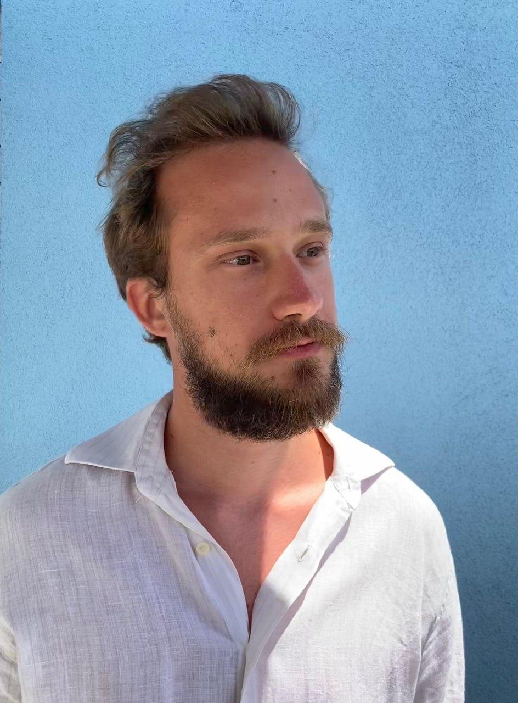
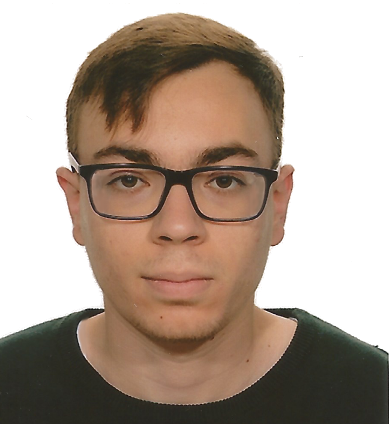
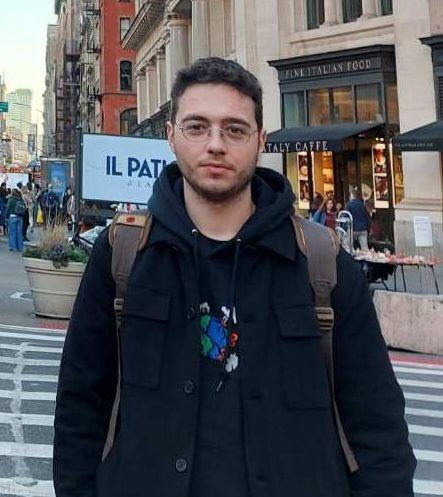

---
  hide:
    -navigation
---

# Principal Investigator

## Konstantinos Chatzilygeroudis

{: style="width:10%"}

**Short bio:** Konstantinos Chatzilygeroudis received the Integrated Master degree (Engineering Diploma) in computer science and engineering from the University of Patras, Patras, Greece, in 2014, and the Ph.D. degree in robotics and machine learning from Inria Nancy-Grand Est, France and the University of Lorraine, Nancy, France in 2018. From 2018 to 2020 he was a Postdoctoral Fellow with the LASA Team with the Swiss Federal Institute of Technology Lausanne (EPFL), Lausanne, Switzerland. He is a recipient of an H.F.R.I. Grant for Post-doctoral Fellows (2022-2024): he is the Principal Investigator of the project "Novel Optimization Methods for Autonomous Skill Learning in Robotics" that is being implemented within the Department of Mathematics, University of Patras, Greece. He has also taught and is still teaching several undergraduate and post-graduate courses on Artificial Intelligence, Computer Science and Robotics at University of Patras, Greece. He has also co-supervised several undergraduate and master theses. He is currently serving as an Associate Co-Chair of the IEEE Technical Committee on Model-based Optimization for Robotics, while he has served as an Associate Editor for several years at the International Conference on Intelligent Robotics (IROS) and actively participated in the organization committee (as a Chair responsible for the virtual part of the conference) of the International Conference on Robot Learning (CoRL) 2021. His work has been published in top-tier journals and conferences in the fields artificial intelligence, machine learning and robotics, and he has received a Best Paper Award at GECCO 2022. He has also actively collaborated with industrial partners: he was the Leader of the R&D Computer Vision Team at Metargus, a pre-seed funded startup (based in Patras, Greece), and he was the Lead Robotics Engineer at Ragdoll Dynamics (company based in London, UK). His research interests include the area of artificial intelligence and focus on reinforcement learning, fast robot adaptation, evolutionary computation and autonomous skill discovery.

**Website:** [https://costashatz.github.io](https://costashatz.github.io)

# Research Team

## Konstantinos Asimakopoulos

{: style="width:10%"}

**Short bio:** Konstantinos Asimakopoulos received his Integrated Master's Diploma in Electrical & Computer Engineering in 2022 from the University of Patras, Greece. While he was an undergraduate student he also worked as a translator for academic books about machine learning and artificial intelligence for Fountasbooks. Through his master's thesis he explored how to use AI to generate art and in particular music composition. In 2023 he enrolled as a PhD candidate in the department of Electrical & Computer Engineering at the University of Patras researching physics informed reinforcement learning. His research interests include robot control, machine learning and how to combine ML with traditional control.

{: style="width:10%"}

**Short bio:** Lampros Printzios received his Integrated Master's Diploma in Electrical & Computer Engineering in 2024 from the University of Patras, Greece. Through his master's thesis he created a 3D printed robotic manipulator and developed several constrained path-planning algorithms for end-effector obstacle-free tracking. In 2024 he enrolled as a PhD candidate in the department of Electrical & Computer Engineering at the University of Patras researching accelerated methods for robot control. His research interests include robot control, machine learning and how to accelerate computations for fast robot control.

**Website:** [https://www.linkedin.com/in/lampros-printzios-ab74bb237](https://www.linkedin.com/in/lampros-printzios-ab74bb237)

# Alumni

## Constantinos Tsakonas

{: style="width:10%"}

**Short bio:** Constantinos Tsakonas is now a doctoral researcher at team LARSEN at Inria, Nancy working on generative AI, specifically diffusion and flow-based techniques, and uncertainty quantification for trajectory prediction. He received his diploma from the Computer Engineering and Informatics Department (CEID) at the University of Patras, Greece in 2023. He worked as a researcher at the same university for almost three years, during and after his diploma contributing to several AI projects. Notably, he worked as a robot learning researcher on the 'Novel Optimization Methods for Autonomous Skill Learning in Robotics (NOSALRO)' project, where he focused on learning representations, generative AI, autonomous skill discovery and learning, Quality-Diversity algorithms, and sim-to-real methods. Before that, he worked at the IoT Laboratory as a machine learning engineer and researcher, with a focus on TinyML and AI-enabled embedded systems. He also contributed to Pfizer’s project, "Voice-based Diagnostics" (direct contract with IoT Laboratory), as a machine learning researcher where he worked on neural network architectures for audio data and state-of-the-art digital signal processing techniques. He has co-authored many publications for international conferences and journals, and he serves as a reviewer on conferences considering Artificial Intelligence and Robotics, with the most notable being the Conference on Neural Information Processing Systems (NeurIPS), the IEEE Robotics and Automation Letters (RA-L), the IEEE-RAS International Conference on Humanoid Robots (Humanoids), and the International Conference on Intelligent Robots and Systems (IROS). Moreover, he was a visiting researcher at TU Dresden, working on domain adaptation and cross-modal models for time series data. Lastly, as an undergraduate, he won the local round of a European machine learning hackathon, where the problem formulation and solution review was carried out by Ernst & Young (EY), and later on, he represented the University of Patras at the final round in Milan, IT, competing in a challenge provided by Infineon Technologies.

**Website:** [https://github.com/iamtsac](https://github.com/iamtsac)

<!-- ## Konstantinos Tsinganos

{: style="width:10%"}

**Short bio:** Konstantinos Tsinganos received his diploma (Integrated Master) in Electrical and Computer Engineering from the University of Patras, Greece in 2019 with an expertise in computer software and digital image processing. Following his undergraduate studies, he enrolled for the postgraduate program "Data-driven Computing and Decision Making" at the Department of Computer Engineering and Informatics (CEID), University of Patras, Greece where he obtained a Master of Science degree in 2021. During his postgraduate studies, he supported as teaching assistant the undergraduate courses of databases, object-oriented programming and intelligent systems and robotics. Currently, he is a first year PhD student at CEID pursuing research on Sim2Real methods for visual-based imitation learning. His research interests include robot learning, computer vision and machine learning. In addition to his academic studies, he is a software engineer at Metargus startup located in Patras, Greece where he is responsible for implementing computer vision and video processing pipelines for basketball game events.

**Website:** [https://kostastsing.github.io](https://kostastsing.github.io) -->

# Advisory Board

## Michael Vrahatis

{: style="width:10%"}

**Short bio:** Michael N. Vrahatis (Greek: Μιχαήλ Ν. Βραχάτης) was born in Kalamata, Greece, on April 27, 1955. He received his Diploma in Mathematics (first academic degree, Ptychio) from the University of Patras in 1978 and his PhD in Mathematics from the same Institution in 1982. His PhD advisor was Prof. Dr. Kosmas I. Iordanidis. He subsequently performed his military service in the Hellenic Navy from January 1983 to March 1985. He is a professor in the Department of Mathematics at the University of Patras since 2000. He is founder of the Computational Intelligence Laboratory of the same department which he has been directing since its beginning in 2004. He is also serving as the director of the newly founded Institute of Artificial Intelligence of University Research Center of Patras. He was a visiting research fellow (faculty member) at the Department of Mathematics, Cornell University, Ithaca, NY, USA (1987–1988). He was a visiting professor at: a) INFN (Istituto Nazionale di Fisica Nucleare), Bologna, Italy (1992, 1994 and 1998); b) Department of Computer Science, Katholieke Universiteit Leuven, Belgium (1999); c) Department of Mechanical Engineering, Center for Ocean Engineering, Design Laboratory, MIT, Cambridge, MA, USA (2000) and d) Collaborative Research Center "Computational Intelligence" (SFB 531) at the Department of Computer Science, University of Dortmund, Germany (2001). He was a visiting researcher at: a) CERN (European Organization of Nuclear Research), Geneva, Switzerland (1992) and b) INRIA (Institut National de Recherche en Informatique et en Automatique), Sophia–Antipolis, France (1998, 2003, 2004 and 2006). The corpus of his work consists of over 400 publications: a) 17 books (including one book published in USA), b) 152 papers in international refereed journals, c) 26 papers in invited and refereed book chapters, d) 73 papers in refereed book chapters and edited volumes, e) 172 papers in refereed conference proceedings and f) 76 other scholarly publications (including international technical reports (one of CERN, three of INRIA, three of University of Dortmund), invited book–reviews, seminar proceedings, two non–refereed journal papers and one non–refereed full–paper conference article, among others).

**Website:** [https://thalis.math.upatras.gr/~vrahatis](https://thalis.math.upatras.gr/~vrahatis)

## Jean-Baptiste Mouret

{: style="width:10%"}

**Short bio:** Jean-Baptiste Mouret is a senior researcher ("directeur de recherche") at Inria, a French research institute dedicated to computer science and mathematics. He was previously an assistant professor (maître de conférences) at ISIR (Institute for Intelligent Systems and Robotics), which is now part of Sorbonne Université. Overall, J.-B. Mouret conducts researches that intertwine machine learning and robotics to make robots more adaptive. He was the principal investigator of an ERC grant (ResiBots - Robots with animal-like resilience, 2015-2020) and was the recipient of a French ANR young researcher grant (Creadapt - Creative adaptation by Evolution, 2012-2015).  His work was featured on the cover of Nature (Cully et al., 2015) and it received the 2017 ISAL award for Distinguished Young Investigator in the field of Artificial Life, the French La Recherche award (2016), and several best papers awards in major scientific conferences.

**Website:** [https://members.loria.fr/JBMouret](https://members.loria.fr/JBMouret)

## Dimitrios Kanoulas

{: style="width:10%"}

**Short bio:** Dimitrios Kanoulas is a UKRI Future Leader Fellow and Associate Professor in Robotics and Computation at University College London (UCL), Department of Computer Science, working in the field of perception and learning for robots that have limbs, including quadrupeds, humanoids, and mobile manipulators. Between 2014-2019 he was a senior postdoctoral researcher at the Italian Institute of Technology (IIT), working with Profs Nikos Tsagarakis and Darwin Caldwell on several EU projects. In August 2014, he completed his PhD at Northeastern University, advised by Prof. Marsette Vona on perception for bipedal locomotion. He started out as a member of the Algorithms and Theory group at Northeastern University. During the summer of 2012, he completed an internship at INRIA in France, advised by Drs Christian Laugier and Alexandros Makris. He received a diploma in Computer Engineering and Informatics Department from University of Patras, Greece in 2008, advised by Prof Paul Spirakis and Dr Charalampos Tsaknakis.

**Website:** [https://dkanou.github.io](https://dkanou.github.io)

# Collaborators

## Dionis Totsila

{: style="width:10%"}

**Short bio:** Dionis Totsila is a Doctoral Researcher at INRIA Nancy (LARSEN Team) and the University of Lorraine, France, where he has been pursuing his Ph.D. since 2023 under the supervision of Dr. Serena Ivaldi and Dr. Jean-Baptiste Mouret. His current research focuses on enhancing robotic capabilities by integrating large language and vision-language models, as well as developing methods for learning bimanual robot skills with human guidance and natural language interaction. Prior to this, he gained industry experience as a Robotics Engineer at Ragdoll Dynamics, London, UK (2022–2023), where he contributed to improving animator workflows by applying robotic control and simulation techniques in Maya. Dionis also held a research role at the AI Group of the Laboratory of Information Systems and Artificial Intelligence, University of Patras (2021–2023), where he worked on advancing neural dynamic policies, reinforcement learning, learning from demonstration, and optimal control strategies. He earned his Integrated Master degree in Computer Engineering and Informatics from the University of Patras in 2023. His academic and professional journey reflects a strong passion for bridging the gap between artificial intelligence research and real-world applications, with interests in robot learning, human-robot interaction, and autonomous skill acquisition.

**Website:** [https://github.com/dtotsila](https://github.com/dtotsila)

## Agisilaos Kounelis

{: style="width:10%"}

**Short bio:** Agisilaos Kounelis is a Computer Engineering & Informatics graduate from the University of Patras, Greece. In the past, he has been an intern for CERN, Amazon, and Microsoft and has participated twice in Google Summer of Code with Mozilla and KDE. He has attended various coding competitions, and he is a recipient of several distinctions from some of the most prestigious hackathons in the world. He has also collaborated with EPFL and Inria Nancy Research Centre and co-authored two research papers. His recent research interests include privileged learning methods for learning robot controllers, the area of focus of his diploma thesis.

**Website:** [https://www.linkedin.com/in/kounelisagis](https://www.linkedin.com/in/kounelisagis)
